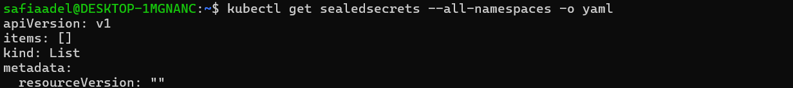
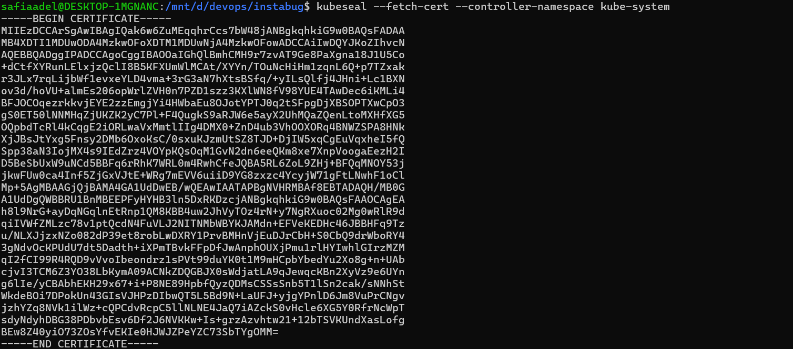
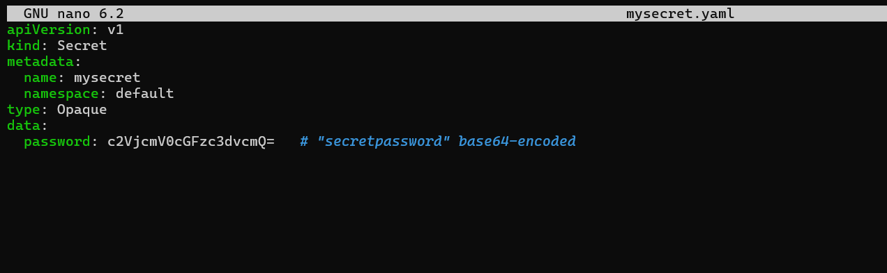
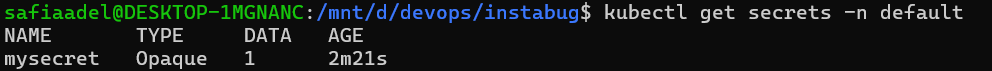

# 🔐 SealedSecrets Auto Re-Encryption Feature — Implementation Plan

## 📘 Overview

This document outlines a detailed plan for implementing **SealedSecret re-encryption automation** as a new feature to the `kubeseal` CLI. The goal is to securely re-encrypt all `SealedSecret` objects in a Kubernetes cluster with the **latest public key**, ensuring secrets remain valid after key rotation.

---

## 📌 Why Automate Re-Encryption?

Bitnami's SealedSecrets rotates keys every 30 days by default. While new SealedSecrets are encrypted with the latest key, **existing ones remain tied to older keys**.

### Benefits of Automation:

- 🛡️ Maintains security hygiene by aligning with current encryption keys.
- 🔄 Reduces manual intervention during key rotations.
- 🚀 Supports GitOps/CI workflows with seamless updates.

---

## 🧠 Key Concepts Recap

| Component                | Description                                                                 |
|--------------------------|-----------------------------------------------------------------------------|
| `kubeseal` CLI           | Encrypts Kubernetes Secrets using a public certificate.                     |
| `SealedSecret`           | Kubernetes CRD holding the encrypted version of the Secret.                  |
| SealedSecrets Controller | Decrypts `SealedSecrets` using a private key and injects native `Secrets`. |
| Public Key               | Used by users to encrypt Secrets. Fetched via `kubeseal --fetch-cert`.      |
| Private Key              | Securely stored in controller; used to decrypt SealedSecrets in-cluster.    |

---

## 🔄 Re-Encryption Workflow

### 🔍 1. Identify Existing SealedSecrets

List all SealedSecrets:

```bash
kubectl get sealedsecrets --all-namespaces -o yaml
```



---

### 🔧 2. Verify `kubeseal` Version

Check your installed version:

```bash
kubeseal --version
```


---

### 📥 3. Fetch Active Public Key

Get the current public certificate from the controller:

```bash
kubeseal --fetch-cert --controller-namespace kube-system
```



---

### 🛠️ 4. Create a Sample Secret

Create a file named `mysecret.yaml`:

```yaml
apiVersion: v1
kind: Secret
metadata:
  name: mysecret
  namespace: default
type: Opaque
data:
  password: c2VjcmV0cGFzc3dvcmQ=   # "secretpassword" base64-encoded
```



---

### 📤 5. Encrypt and Apply SealedSecret

Encrypt and apply the SealedSecret:

```bash
kubeseal --cert cert.pem -o yaml < mysecret.yaml > mysealedsecret.yaml
kubectl apply -f mysealedsecret.yaml
```


---

### 🔎 6. Verify the Secret

Check if the secret has been created:

```bash
kubectl get secrets -n default
```



---

## 🏁 Summary

This implementation demonstrates the core steps needed to build a `kubeseal reencrypt` feature. Automating this process ensures that all SealedSecrets stay aligned with the active encryption key, increasing security and simplifying cluster management.

---

